# The Jetsetter Journal

The Jetsetter Journal is a website for frequent travellers to search for inspiration for their upcoming holidys. Users are also able to share and manage their own recommendations via their profile page.

The app is made with Python using the Flask framework, data is stored in a MongoDB database and is hosted on Heroku.

The [live website is here](https://the-jetsetters-journal-834f32dcb176.herokuapp.com/).

## Table of Contents

### User Experience (UX) 
- [Strategy](#strategy)
- [Scope](#scope)
- [Structure](#structure)
- [Skeleton](#skeleton)
- [Surface](#surface)

### Features
### Technologies
### Testing
### Future Improvements
### Deployments
### Credits

-----

## Strategy

### Site goals
- To give travellers the opportunity to share their travel experiences and recommendations for specific destinations.
- To provide information to travellers planning an upcoming holiday and looking to put together an itinerary.

### User Stories

#### As a first-time user:
- I want to understand the purpose of the website as soon as I land on it.
- I want the site to be fully responsive and viewable on any device.
- I want to easily return to the homepage if any errors occur.

#### As a user without an account:
- I want to find what I need easily with intuitive navigation.
- I want to search and filter destination information.
- I want the opportunity to create an account.

#### As a user with an account:
- I want to sign in to my account.
- I want to log out successfully.
- I want to add my own recommendations.
- I want to view, edit, and delete my recommendations.

------

## Scope

The table below shows all features of the site, detailing the user type, difficulty, and importance ratings. Prioritization was based on these ratings during the build phase.

| User               | Feature                                                       | Difficulty | Importance |
|--------------------|---------------------------------------------------------------|------------|------------|
| All users          | Responsive Design                                              |     3     |      4   |
| All users          | MongoDB database creation to store data                        |      5      |        5    |
| All users          | Navigation                                                    |       1    |      4      |
| All users          | Home page - about section and search functionality            |       1     |    2      |
| Users with an account       | Profile page - travel destination on map with clickable markers |      5      |     3     |
| Users with an account | Travel destination information page with ability to view user recommendations |  3      |4      |
| Users with an account        | Log-in/ Logout functionality                         |  5       |       5    |
| All users          | Registration functionality                                     |      5      |      5      |
| All users          | Error pages providing home page links                          |       2     |     3       |
| Users with an account | CRUD functionality                              |      5      |       5     |

------

## Structure

The site consists of 8 pages, including:

### Home page and search page
- An about section explaining the purpose of the app
- Search bar that enables the user to view all recommendations made on the app and filter the results by user, category, city name and comment

### Registration page
- User sign-up form

### Login page
- User login form

### Profile page
- Interactive map with clickable markers that signals to the user the available countries to view and recommendations

### Location/recommendations page
- Loads the user recommendations and location information based on the country that is selected on the interactive map
- Users can view the recommendations they've created and choose to edit or delete their recommendations if required

### Add recommendations page
- Form to add recommendations

### Edit recommendations page
- Form to edit a recommendation

### Delete recommendations page
- Seeks confirmation from user that they wish to delete a recommendation

-----

## Database Structure

All data is stored in a Mongodb non-relational database. The database itself is made up of 3 collections: 

- Users
- Locations 
- Recommendations 

Each user is structured in a document consisting of the following information:

Users sign up with a username and a password which is hashed by Werkzeug before being stored in Mongodb. All recommendations added to the platform are assigned with the corresponding username that added that particular recommendation. 

Each available location on the site is structured like so: 

The location information is dynamically rendered to the view_recommendations page depending on the location selected on the interactive map. 

Each recommendation added to the application is structured in the following way: 

Each recommendation is linked to a city_id, corresponding to the object_id of the location it pertains to. For instance, a recommendation for Bangkok includes the object_id associated with the Bangkok location, stored in the city_id field. This linkage proves beneficial when adding recommendations or searching for specific recommendations within a particular city.

Recommendations are grouped into 3 categories: 

- Things to do
- Where to eat
- Where to stay

Each recommendation is assigned a unique object_id, allowing for targeted queries and rendering of specific recommendations within the application interface. This unique identifier facilitates the editing and deletion of recommendations on the site.

## Skeleton

I've linked the wireframes for each page below: 

- [Home page](static/wireframes/home_page.png)
- [Log In page](static/wireframes/logIn_page.png)
- [Register page](static/wireframes/register_page.png)
- [Profile page](static/wireframes/profile_page.png)
- [View recommendations page](static/wireframes/view_recommendations_page.png)
- [Add recommendations page](static/wireframes/add_recommendations_page.png)
- [Edit recommendations page](static/wireframes/edit_recommendations_page.png)
- [Delete confirmation page](static/wireframes/delete_confirmation.png)

## Surface

The application is presented with a background hero image throughout. I am using one of my own images as it's suitable for the site's purpose. The nav bar is a solid teal colour and the nav items are white to contrast the navbar. 

The majority of the headings and text are white to contrast the blue hero background image. The only exception to this is the recommendations which are in black as they are displayed on a solid white background to ensure readability. 

The Google font Poppins is used for all the text on the site. This font gives the application a simple but professional feel to it.

## Features

All features on the app are designed mobile-first as it is likely that users will be viewing this on their phone. The majority of the styling was obtained through Materialize.CSS with custom styling applied particularly for responsiveness.

The colour theme is mostly blue, teal and white. All text has been given the font Poppins. The colour scheme and font have been used throughout for consistency.

The features of the Jetsetters Journal are as follows: 

- Responsive design
- App linked to Mongodb to store data
- Intuitive navigation bar
- Home page with search functionality
- Profile page with interactive map
- Travel destination page dynamically rendered 
- User authentication functionality
- Error 404 and 500 pages
- CRUD functionality 

### Responsive design

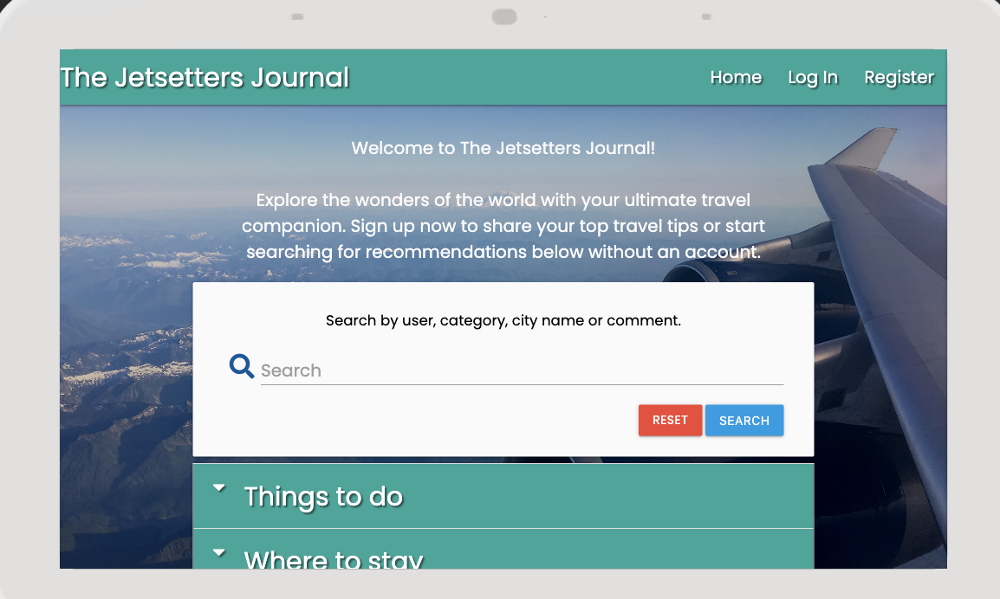
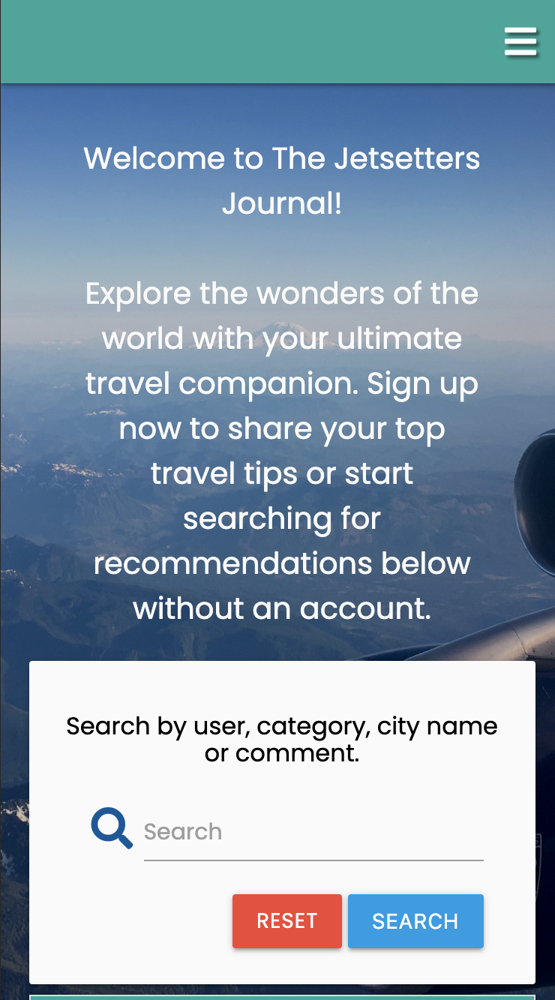

The site is designed to be fully responsive, ensuring a seamless user experience across various devices, including desktops, tablets, and mobile phones.

This satisfies the user story: I want the site to be fully responsive and viewable on any device.

### Intuitive Navigation Bar

The navigation bar provides easy access to essential pages, facilitating smooth, intuitive navigation for users. Some navbar items are only accessible to users with accounts making certain functionality only available once the user is authenticated. 

This satisfies the user story: I want to find what I need easily with intuitive navigation.

### Home Page with Search Functionality

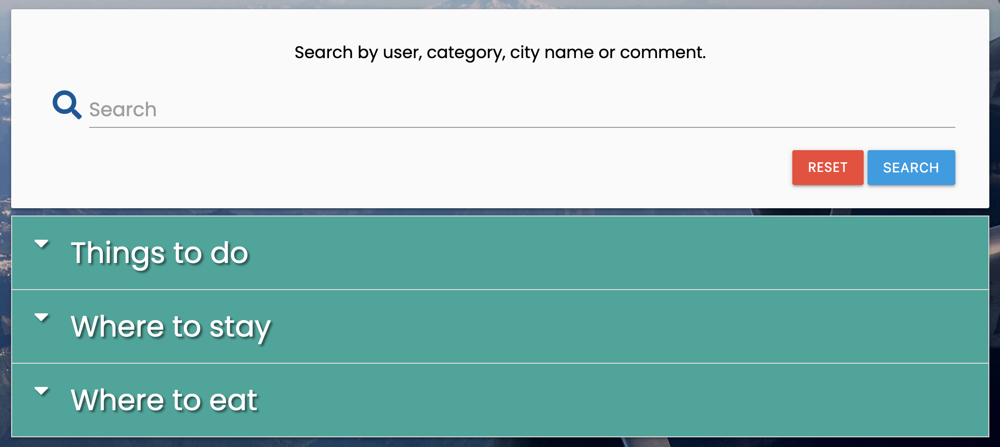

The home page features a search bar allowing users to search for travel recommendations based on various criteria, such as user, category, comment, or city.

This satisfies the user stories: 

I want to understand the purpose of the website as soon as I land on it.
I want to search and filter destination information.

### Profile Page with Interactive Map

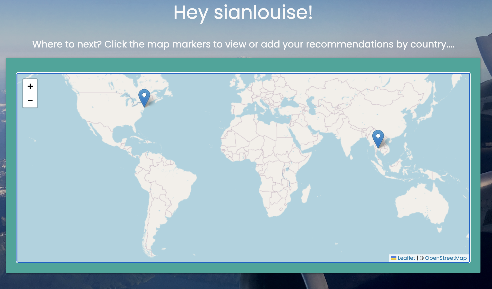

Users have individual profile pages displaying an interactive map. This allows the users to navigate to the location/ recommendation information that they wish to see in a visually engaging manner.

This satisfies the user story: I want to search and filter destination information.

### Dynamically Rendered Travel Destination Page

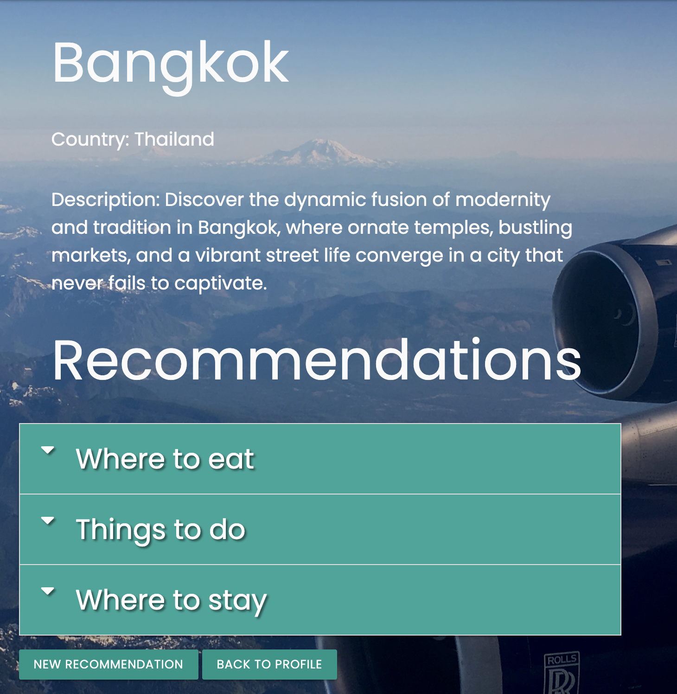

Travel destination pages are dynamically rendered based on the selected city, displaying relevant recommendations for that location.

This satisfies the user story: I want to search and filter destination information.

### User Authentication Functionality

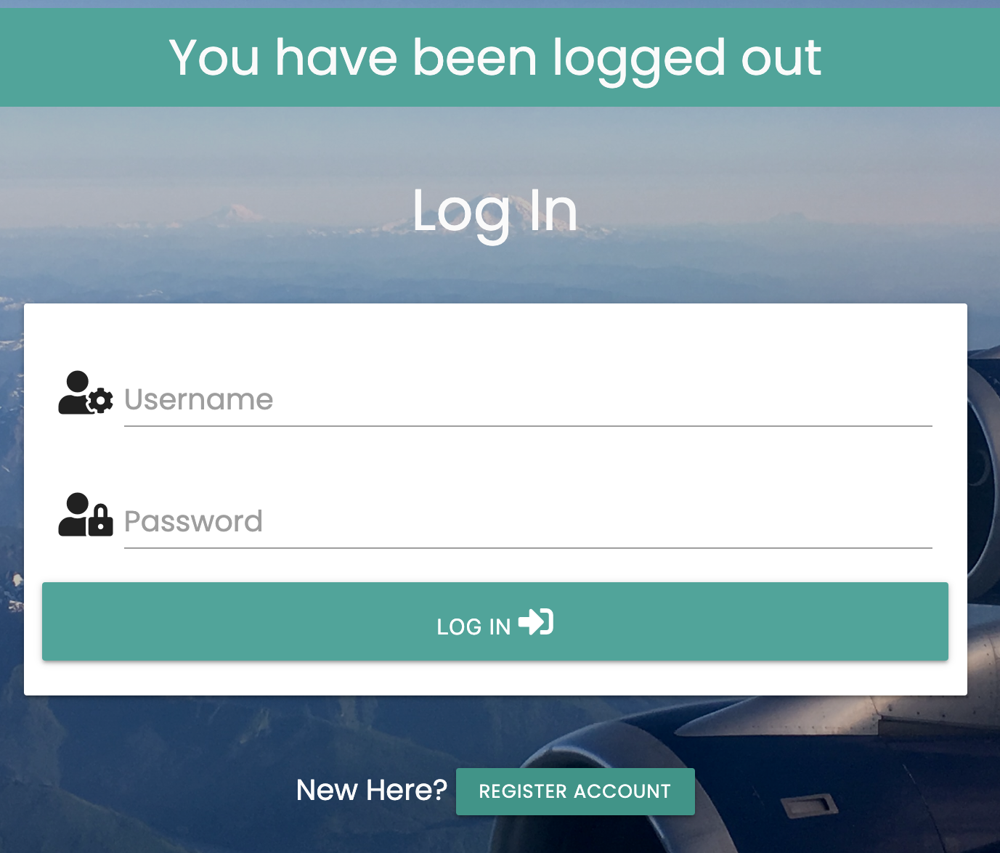

Secure user authentication is implemented, allowing users to register, log in, and log out with hashed passwords for enhanced security.

This satisfies the user stories: 

I want the opportunity to create an account
I want to sign in to my account
I want to log out successfully

### Error Pages (404 and 500)

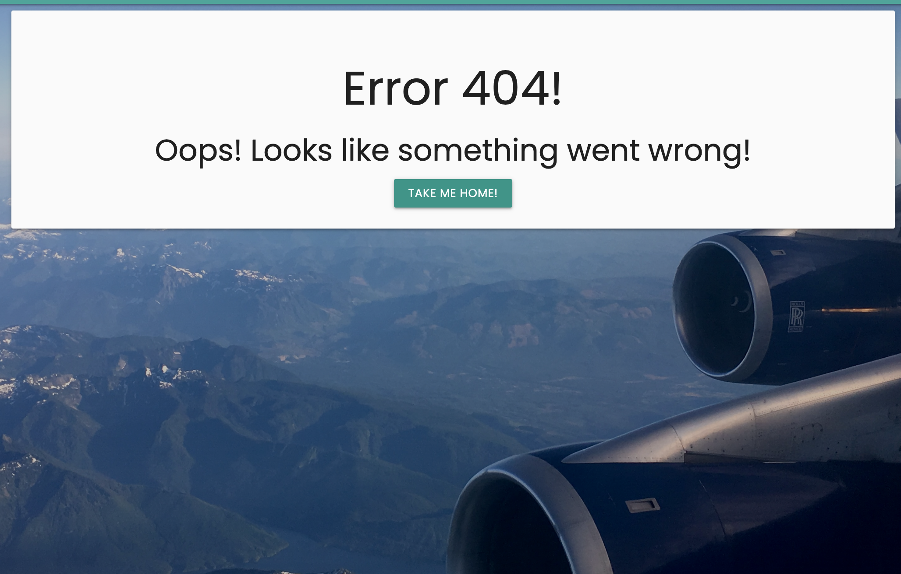

Custom error pages are provided for better user experience in case they encounter a page not found (404) or internal server error (500).

This satisfies the user story: I want to easily return to the homepage if any errors occur.

### CRUD Functionality

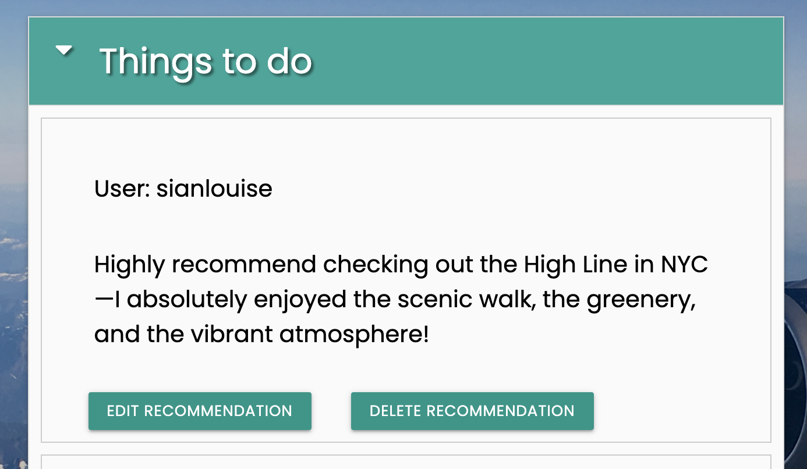
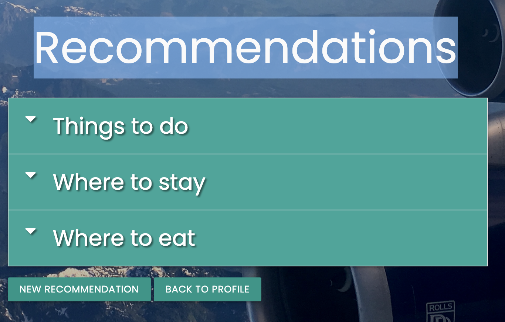

The application supports CRUD operations (Create, Read, Update, Delete) for travel recommendations, allowing users to add, edit, and delete their own recommendations.

This satisfies the user stories: 

I want to add my own recommendations.
- I want to view, edit, and delete my recommendations.

### MongoDB Integration

The application is linked to a MongoDB database to store user authentication information, travel recommendations, and other location information. 

-----

## Technologies

## What I Used

To create this project I used the following:

- [HTML](https://www.w3schools.com/html/html_intro.asp) - The coding language used to create the structure of the website.
- [CSS](https://www.w3schools.com/css/css_intro.asp)  -The coding language used to style the site throughout.
- [Javascript](https://www.w3schools.com/js/js_intro.asp) - The coding language used for all the interactive components of the website. I used Materialize JS, JQuery and my own Javascript script within this project.
- [Python](https://www.python.org/) - The coding language used for all backend functions.
- [Leaflet.JS](https://leafletjs.com/ ) - Used to add the interactive map
- [JQuery](https://jquery.com/) - The Javascript library used to write custom script.
- [MaterializeCSS](https://materializecss.com/) - The CSS framework used for most of my styling.
- [Jinja](https://jinja.palletsprojects.com/en/3.0.x/) - The templating language used in conjunction with Python.
- [Heroku](https://www.heroku.com/) - Source to deploy the application.
- [MongoDB](https://www.mongodb.com/) - The non-relational database that stored all data for this project.
- [Google Fonts](https://fonts.google.com/) - Fonts for both the headers and the body text were taken from here. The font I used is Poppins.
- [Font Awesome](https://fontawesome.com/search) - Used for all icons used on the app
- [Chrome Developer Tools](https://developer.chrome.com/docs/devtools/) - Used to test responsiveness across the site.
- [GitHub](https://github.com/) - Used as a storage space for my pushed code.
- [Git](https://git-scm.com/) - Used for version control to make commits and push to GitHub.
- [CodeAnywhere](https://app.codeanywhere.com/) - The cloud development environment I used to build the site.
- [Gitpod](https://www.gitpod.io/) - The cloud development environment I shifted to when CodeAnywhere was inaccessible.
- [Balsamiq](https://balsamiq.cloud/sidwtio/poonp92/rD331) - Used to create the wireframes.
- [W3C Markup Validation Service](https://validator.w3.org/) - Used to validate all HTML written for the site.
- [W3C CSS Validation Service](https://jigsaw.w3.org/css-validator/) - Validated all CSS code written for the site.
- [JS Hint](https://jshint.com/) - Validated my custom JS file.
- [Code Institute Python Linter](https://pep8ci.herokuapp.com) - Validated my Python script to ensure I was PEP8 compliant
- [AmIResponsive](https://ui.dev/amiresponsive) - Used to create the responsive image you see at the top of the README file.

The following modules were run for this project: 

- click==7.1.2
- dnspython==1.16.0
- Flask==2.0.1
- Flask-PyMongo==2.3.0
- itsdangerous==2.1.0
- Jinja2==3.1.3
- pymongo==3.11.3
- Werkzeug==2.0.1

## Testing

The project was deployed early to gather feedback throughout development and to find any bugs. I used Chrome Dev Tools to help test responsiveness.

Chrome Dev Tools was used to emulate the following devices: 

- Apple iPhone SE
- Apple iPhone XR
- Apple iPhone 12 Pro
- Google Pixel 5
- Samsung Galaxy S8+

The project was also manually tested on the iPhone 12 Pro Max and Samsung Galaxy 20FE.

All HTML pages were validated with [W3C Markup Validation Service](https://validator.w3.org/). The only error and warnings that were flagged were the url for links and Jinja templating.  

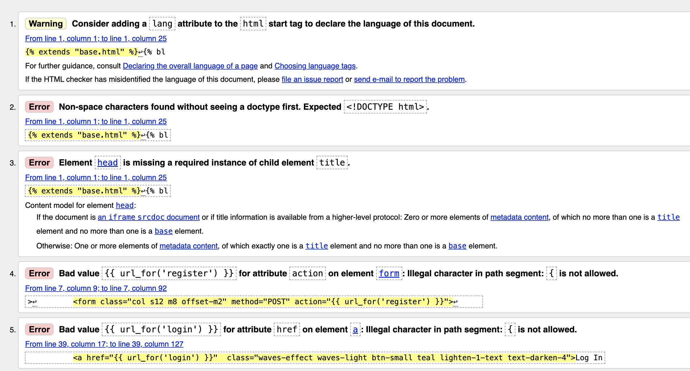

My custom CSS file was validated with [W3C CSS Validation Service](https://jigsaw.w3.org/css-validator/).

My custom JS file was validated with [JS Hint](https://jshint.com/)

All warnings were corrected by prefixing my code with the comments: /*global $, L*/
These were global variables defined outside of the functions as I was using JQuery and LeafletJS. 

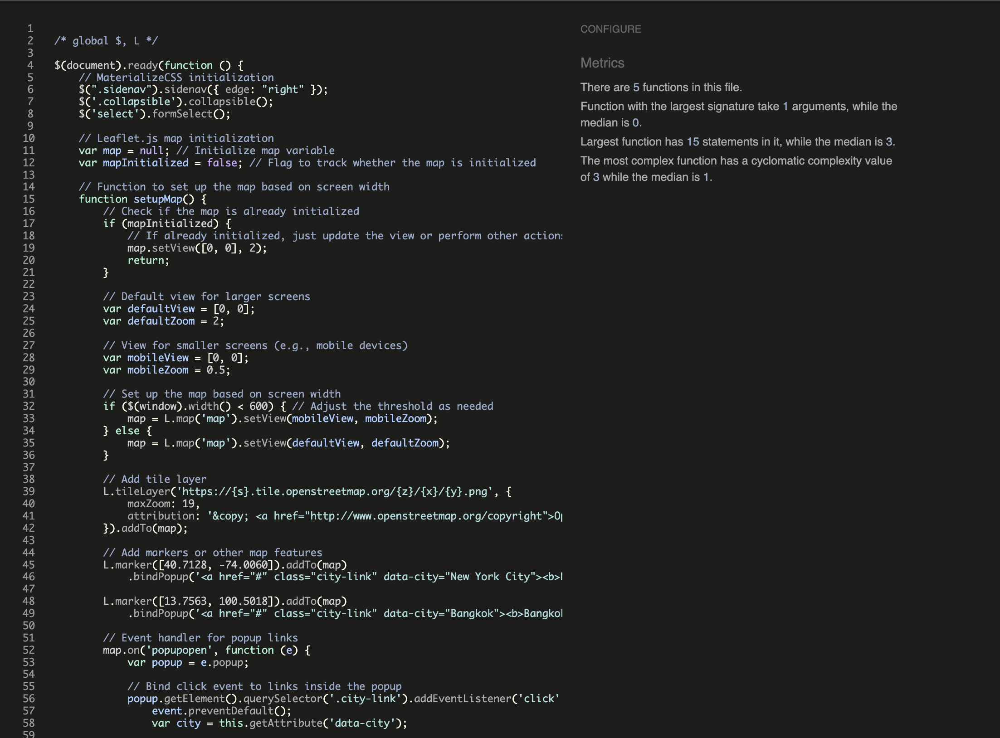

I checked for PEP8 compliance with the [Code Institute Python Linter](https://pep8ci.herokuapp.com).

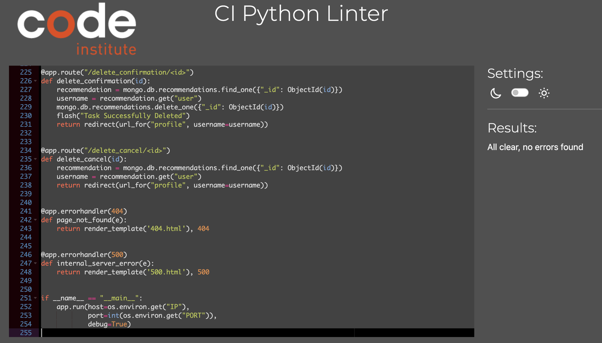

### Lighthouse

Lighthouse is a feature of Chrome developer tools that performs an audit of any URL that it's given and returns an overall score based on website's performance. When I audited the site it returned this: 

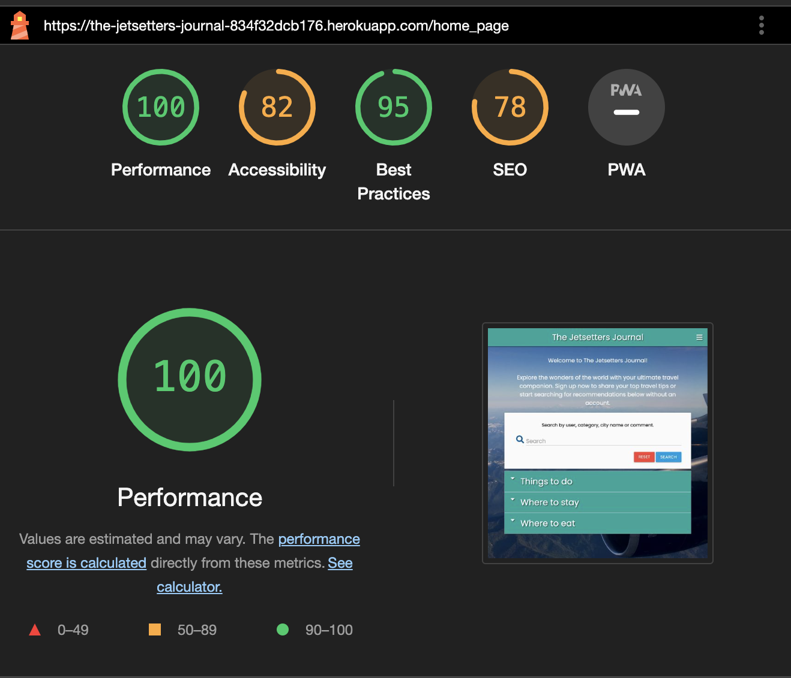

Considering that I was close to the project deadline, I decided that I would prioritise the documentation write up over improving this.

From the report and the error in the console, I believe there's an error relating to the interactive map that is slowing the performance of the app. More on this error later! 

## Defensive Programming 

Defensive programming was manually tested with the following results: 

| Page | User Action | Expected Result | Pass/Fail | Comments |
| --- | --- | --- | --- | --- |
| Home Page | | | | |
| | Click on Logo | Redirection to Home page | Pass | |
| | Click on Home link in navbar | Redirection to Home page | Pass | |
| | Click on Search Bar | cursor enters input field | Pass | |
| | Type a user name and Press Enter | Redirection to Search-results page | Pass | |
| | Type a city name and Press Enter | Redirection to Search-results page | Pass | |
| | Click on the Nav Bar Login link | Login page opens | Pass | |
| | Click on the Nav Bar Register link | Register page opens | Pass | |
| Register | | | | |
| | Click on the Nav Bar Register link | Register page opens | Pass | |
| | Enter valid User Name | Field will only accept alphanumeric username | Pass | |
| | Enter valid password | Field will only accept alphanumeric password format | Pass | |
| | Click Register button with valid Username & Password | Redirects user to Profile page | Pass | |
| | Click Register button with empty Password field | Prompts for Password | Pass | |
| | Click Register button with empty Username field | Prompts for Username | Pass | |
| | Click Register button with both input fields empty | Prompts for input | Pass | |
| | Click Already Registered link | Opens Log In Modal | Pass | |
| Log In | | | | |
| | Click on the Login link | Redirection to Login page | Pass | |
| | Enter valid User Name | Field will only accept alphanumeric username | Pass | |
| | Enter valid password | Field will only accept alphanumeric password format | Pass | |
| | Click Log In button with valid Username & Password | Redirects user to Library page | Pass | |
| | Click Log In button with empty Password field | Prompts for Password | Pass | |
| | Click Log In button with empty Username field | Prompts for Username | Pass | |
| | Click Log In button with both input fields empty | Prompts for input | Pass | |
| | Click New Here link | Opens Sign Up Modal | Pass | |
| Log Out | | | | |
| | Click Logout button | Redirects user to Home page | Pass |  |

I don't have enough experience with TDD to do proper testing on my Javascript and Python functions. Most of this was done with trial and error through running tests in my IDE. 

The same goes for checking my connection with Mongodb. At the start, I had a lot of issues with this and created a separate python file to test my connection with Mongo. It proved to be pretty invaluable in the early stages as I had quite a lot of problems connecting. Big shout out to the tutors at Code Institute for helping me with my env.py file - particularly my MongoURI which has since changed format since the walk-through project was created. 

I did heavily rely on the walk-through project for non-relational databases in the course material so a lot of the CRUD functionality was quite straight forward. 

## Known bugs 

There is an issue with the interactive map not initialising all of the time which I did not have time to fix. I started to notice it when I created a media query to render a different size box and zoom of the map on a smaller screen. I'm not sure if that's a coincidence or not. 

As the problem can be fixed by hard reloading the page, I decided to prioritise other things but I would like to come back to this project at a later date to fix this. 

There is also a styling issue on the forms where the drop down inputs highlight in green despite not selecting a city name or category. There was a section of the walk through project that addressed this but unfortunately the JQuery that was provided did not seem to fix the issue. Again, as it didn't impact on the functionality of the app, I decided to prioritise other things but I would like to come back to fix this. 

# Future Improvements 

As has been the case with all of my projects I didn't have a lot of time to complete this app which was a shame as I really enjoyed making it. I'm fond of Python and Javascript and being able to use them together was fun! 

If I'd had more time, I would like to have created superuser access so that an admin account could have complete CRUD functionality over all recommendations. I would also have built an Add location page as well so that more locations could be added from the frontend via the superuser. 

I would also like to build a feature that enabled users with an account to rate other's recommendations. For every good rating that a user got it gave them more status on the page. Think of it as the Jetsetter's Journal version of the Uber driving rating. 
