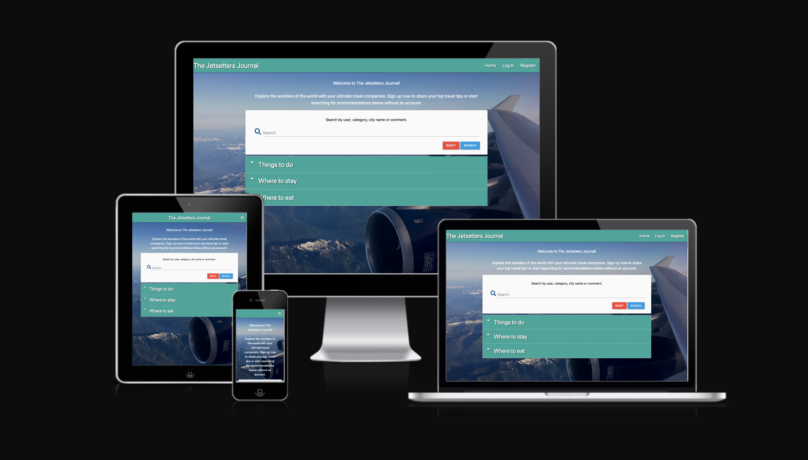
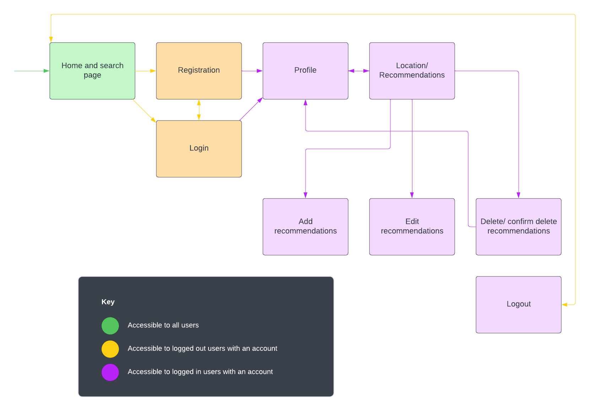
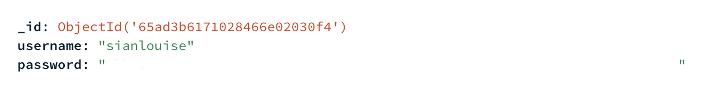
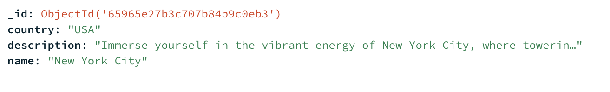
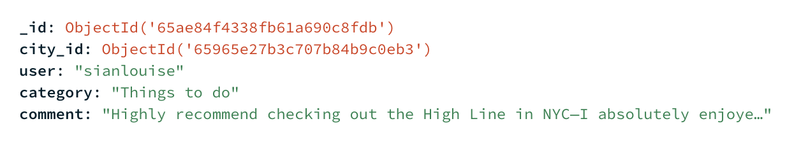

# The Jetsetter Journal

The Jetsetter Journal is a website for frequent travellers to search for inspiration for their upcoming holidys. Users are also able to share and manage their own recommendations via their profile page.

The app is made with Python using the Flask framework, data is stored in a MongoDB database and is hosted on Heroku.

The [live website is here](https://the-jetsetters-journal-834f32dcb176.herokuapp.com/).

## Table of Contents

### User Experience (UX)
- Strategy
- Scope
- Structure
- Skeleton
- Surface

### Features
### Technologies
### Testing
- Test Results and Bugs
### Future Improvements
### Deployment
### Credits

-----

## Strategy

### Site goals
- To give travellers the opportunity to share their travel experiences and recommendations for specific destinations.
- To provide information to travellers planning an upcoming holiday and looking to put together an itinerary.

### User Stories

#### As a first-time user:
- I want to understand the purpose of the website as soon as I land on it.
- I want the site to be fully responsive and viewable on any device.
- I want to easily return to the homepage if any errors occur.

#### As a user without an account:
- I want to find what I need easily with intuitive navigation.
- I want to view information about the destination I plan to travel to.
- I want the opportunity to create an account.

#### As a user with an account:
- I want to sign in to my account.
- I want to log out successfully.
- I want to search and filter destination information.
- I want to add my own recommendations.
- I want to view, edit, and delete my recommendations.

------

## Scope

The table below shows all features of the site, detailing the user type, difficulty, and importance ratings. Prioritization was based on these ratings during the build phase.

| User               | Feature                                                       | Difficulty | Importance |
|--------------------|---------------------------------------------------------------|------------|------------|
| All users          | Responsive Design                                              |     3     |      4   |
| All users          | MongoDB database creation to store data                        |      5      |        5    |
| All users          | Navigation                                                    |       1    |      4      |
| All users          | Home page - branding and about section                         |       1     |      2      |
| All users          | Home page - travel destination on map with clickable markers |      5      |       3     |
| Users with an account | Travel destination information page with ability to view user recommendations |       3       |      4      |
| All users          | Log-in functionality                                          |     5       |       5    |
| All users          | Registration functionality                                     |      5      |      5      |
| All users          | Error pages providing home page links                          |       2     |     3       |
| Users with an account | Logout functionality                                        |       5     |       5     |
| Users with an account | Profile page                                                   |    4        |     4       |
| Users with an account | Add recommendation functionality                              |      5      |       5     |
| Users with an account | Edit/ delete functionality for user’s own recommendations     |       4     |        5    |

------

## Structure

The site consists of 8 pages, including:

### Home page and search page
- An about section explaining the purpose of the app
- Search bar that enables the user to view all recommendations made on the app and filter the results by user, category, city name and comment

### Registration page
- User sign-up form

### Login page
- User login form

### Profile page
- Interactive map with clickable markers that signals to the user the available countries to view and recommendations

### Location/recommendations page
- Loads the user recommendations and location information based on the country that is selected on the interactive map
- Users can view the recommendations they've created and choose to edit or delete their recommendations if required

### Add recommendations page
- Form to add recommendations

### Edit recommendations page
- Form to edit a recommendation

### Delete recommendations page
- Seeks confirmation from user that they wish to delete a recommendation

-----

## Database Structure

All data is stored in a Mongodb non-relational database. The database itself is made up of 3 collections: 

- Users
- Locations 
- Recommendations 

Each user is structured in a document consisting of the following information:

Users sign up with a username and a password which is hashed by Werkzeug before being stored in Mongodb. All recommendations added to the platform are assigned with the corresponding username that added that particular recommendation. 

Each available location on the site is structured like so: 

The location information is dynamically rendered to the view_recommendations page depending on the location selected on the interactive map. 

Each recommendation added to the application is structured in the following way: 

Each recommendation is linked to a city_id, corresponding to the object_id of the location it pertains to. For instance, a recommendation for Bangkok includes the object_id associated with the Bangkok location, stored in the city_id field. This linkage proves beneficial when adding recommendations or searching for specific recommendations within a particular city.

Recommendations are grouped into 3 categories: 

- Things to do
- Where to eat
- Where to stay

Each recommendation is assigned a unique object_id, allowing for targeted queries and rendering of specific recommendations within the application interface. This unique identifier facilitates the editing and deletion of recommendations on the site.

## Skeleton

I've linked the wireframes for each page below: 

- [Home page](static/wireframes/home_page.png)
- [Log In page](static/wireframes/logIn_page.png)
- [Register page](static/wireframes/register_page.png)
- [Profile page](static/wireframes/profile_page.png)
- [View recommendations page](static/wireframes/view_recommendations_page.png)
- [Add recommendations page](static/wireframes/add_recommendations_page.png)
- [Edit recommendations page](static/wireframes/edit_recommendations_page.png)
- [Delete confirmation page](static/wireframes/delete_confirmation.png)

## Surface

The application is presented with a background hero image throughout. I am using one of my own images as it's suitable for the site's purpose. The nav bar is a solid teal colour and the nav items are white to contrast the navbar. 

The majority of the headings and text are white to contrast the blue hero background image. The only exception to this is the recommendations which are in black as they are displayed on a solid white background to ensure readability. 

The Google font Poppins is used for all the text on the site. This font gives the application a simple but professional feel to it.
